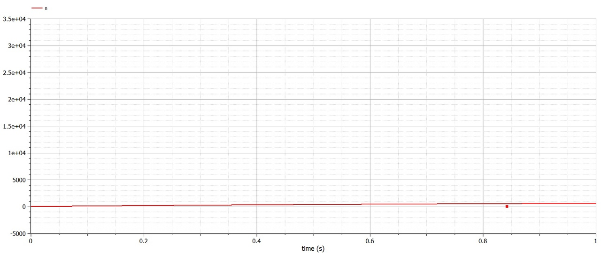
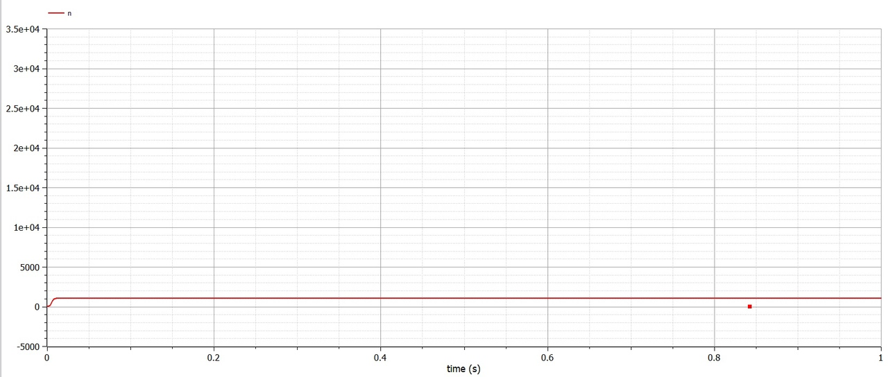

---
## Front matter
lang: ru-RU
title: Лабораторная работа №7
subtitle: Задача о распространении рекламы
author:
  - Болотина А. С.
institute:
  - Российский университет дружбы народов, Москва, Россия
date: 25 марта 2023

## i18n babel
babel-lang: russian
babel-otherlangs: english

## Formatting pdf
toc: false
toc-title: Содержание
slide_level: 2
aspectratio: 169
section-titles: true
theme: metropolis
header-includes:
 - \metroset{progressbar=frametitle,sectionpage=progressbar,numbering=fraction}
 - '\makeatletter'
 - '\beamer@ignorenonframefalse'
 - '\makeatother'
---

# Информация

## Докладчик

:::::::::::::: {.columns align=center}
::: {.column width="70%"}

  * Болотина Александра Сергеевна
  * студент группы НПИбд-02-19
  * Российский университет дружбы народов
  * [1032192943@pfur.ru](mailto:1032192943@pfur.ru)
  * <https:https://github.com/AleksandraBolotina>

:::
::: {.column width="30%"}

:::
::::::::::::::

# Вводная часть

## Актуальность

- Необходим навык математического моделирования, которое является неизбежной составляющей научно-технического прогресса

## Объект и предмет исследования

- Задача о распространении рекламы

## Цели и задачи

Построить график для задачи о распространении рекламы

# Выполнение работы

## Изучение теории

Организуется рекламная кампания нового товара или услуги. Необходимо,
чтобы прибыль будущих продаж с избытком покрывала издержки на рекламу.
Вначале расходы могут превышать прибыль, поскольку лишь малая часть
потенциальных покупателей будет информирована о новинке. Затем, при
увеличении числа продаж, возрастает и прибыль, и, наконец, наступит момент,
когда рынок насытиться, и рекламировать товар станет бесполезным.  
  Предположим, что торговыми учреждениями реализуется некоторая
продукция, о которой в момент времени t из числа потенциальных покупателей N
знает лишь n покупателей. Для ускорения сбыта продукции запускается реклама
по радио, телевидению и других средств массовой информации. После запуска
рекламной кампании информация о продукции начнет распространяться среди
потенциальных покупателей путем общения друг с другом. Таким образом, после
запуска рекламных объявлений скорость изменения числа знающих о продукции
людей пропорциональна как числу знающих о товаре покупателей, так и числу
покупателей о нем не знающих.  
  Модель рекламной кампании описывается следующими величинами.
Считаем, что $\frac{\partial n}{\partial t}$ - скорость изменения со временем числа потребителей,
узнавших о товаре и готовых его купить, t - время, прошедшее с начала рекламной
кампании, n(t) - число уже информированных клиентов. Эта величина
пропорциональна числу покупателей, еще не знающих о нем, это описывается
следующим образом: $a_{1}(t)(N-n(t))$, где N - общее число потенциальных
платежеспособных покупателей, $a_{1}(t)>0$ - характеризует интенсивность
рекламной кампании (зависит от затрат на рекламу в данный момент времени).
Помимо этого, узнавшие о товаре потребители также распространяют полученную
информацию среди потенциальных покупателей, не знающих о нем (в этом случае
работает т.н. сарафанное радио). Этот вклад в рекламу описывается величиной
$a_{2}(t)n(t)(N-n(t))$, эта величина увеличивается с увеличением потребителей
узнавших о товаре. Математическая модель распространения рекламы описывается
уравнением: $\frac{\partial n}{\partial t} = (0.91+0.00005*n(t))(N-n(t))$ 

## Написание кода 
Написала программу на Modelica для 1 случая:
```
model lab07
  parameter Real a=0.83;
  parameter Real b=0.000083;
  parameter Real N=1030;
  parameter Real n0=8;
  Real n(start=n0);
equation
  der(n)=(a+b*n)*(N-n); 
end lab07;
```
Написала программу на Modelica для 2 случая:
```
model lab0702
  parameter Real a=0.000083;
  parameter Real b=0.83;
  parameter Real N=1030;
  parameter Real n0=8;
  Real n(start=n0);
equation
  der(n)=(a+b*n)*(N-n); 
end lab0702;
```

# Результаты

## Результат

Получила следующий график для 1 случая (см. рис. -@fig:002).

{ #fig:002 width=70% } 

Получила следующий график для 2 случая (см. рис. -@fig:003).

{ #fig:003 width=70% }

# Вывод

## Вывод

Я построила график распространения рекламы.
