---
## Front matter
title: "Отчет по лабораторной работе №8"
subtitle: "Дисциплина: Математическое моделирование"
author: "Выполнила: Болотина Александра Сергеевна"

## Generic otions
lang: ru-RU
toc-title: "Содержание"

## Bibliography
bibliography: bib/cite.bib
csl: pandoc/csl/gost-r-7-0-5-2008-numeric.csl

## Pdf output format
toc: true # Table of contents
toc-depth: 2
lof: true # List of figures
lot: true # List of tables
fontsize: 12pt
linestretch: 1.5
papersize: a4
documentclass: scrreprt
## I18n polyglossia
polyglossia-lang:
  name: russian
  options:
	- spelling=modern
	- babelshorthands=true
polyglossia-otherlangs:
  name: english
## I18n babel
babel-lang: russian
babel-otherlangs: english
## Fonts
mainfont: PT Serif
romanfont: PT Serif
sansfont: PT Sans
monofont: PT Mono
mainfontoptions: Ligatures=TeX
romanfontoptions: Ligatures=TeX
sansfontoptions: Ligatures=TeX,Scale=MatchLowercase
monofontoptions: Scale=MatchLowercase,Scale=0.9
## Biblatex
biblatex: true
biblio-style: "gost-numeric"
biblatexoptions:
  - parentracker=true
  - backend=biber
  - hyperref=auto
  - language=auto
  - autolang=other*
  - citestyle=gost-numeric
## Pandoc-crossref LaTeX customization
figureTitle: "Рис."
tableTitle: "Таблица"
listingTitle: "Листинг"
lofTitle: "Список иллюстраций"
lotTitle: "Список таблиц"
lolTitle: "Листинги"
## Misc options
indent: true
header-includes:
  - \usepackage{indentfirst}
  - \usepackage{float} # keep figures where there are in the text
  - \floatplacement{figure}{H} # keep figures where there are in the text
---

# Цель работы

Ознакомление с моделью конкуренции двух фирм для двух случаев (без учета и с учетом социально-психологического фактора) и их построение с помощью языка программирования Modelica.


# Задание

**Вариант № 35**:

  Рассмотрим две фирмы, производящие взаимозаменяемые товары одинакового качества и находящиеся в одной рыночной нише. Считаем, что в рамках нашей модели конкурентная борьба ведётся только рыночными методами. То есть, конкуренты могут влиять на противника путем изменения параметров своего производства: себестоимость, время цикла, но не могут прямо вмешиваться в ситуацию на рынке («назначать» цену или влиять на потребителей каким-либо иным способом.) Будем считать, что постоянные издержки пренебрежимо малы, и в модели учитывать не будем. В этом случае динамика изменения объемов продаж фирмы 1 и фирмы 2 описывается следующей системой уравнений  
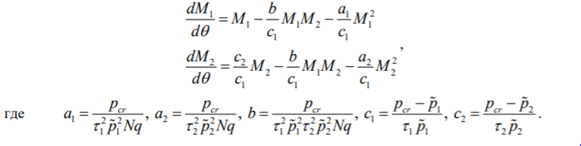{ #fig:001 width=70% }
  
Рассмотрим модель, когда, помимо экономического фактора влияния (изменение себестоимости, производственного цикла, использование кредита и т.п.), используются еще и социально-психологические факторы – формирование общественного предпочтения одного товара другому, не зависимо от их качества и цены. В этом случае взаимодействие двух фирм будет зависеть друг от друга, соответственно коэффициент перед M M1 2 будет отличаться. Пусть в рамках рассматриваемой модели динамика изменения объемов продаж фирмы 1 и фирмы 2 описывается следующей системой уравнений.
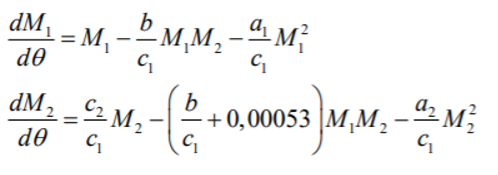{ #fig:002 width=70% }
Для обоих случаев рассмотрим задачу со следующими начальными условиями и параметрами
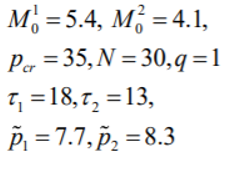{ #fig:003 width=70% }

# Теоретическое введение

Для построения модели конкуренции хотя бы двух фирм необходимо рассмотреть модель одной фирмы. Вначале рассмотрим модель фирмы, производящей продукт долговременного пользования, когда цена его определяется балансом спроса и предложения. Примем, что этот продукт занимает определенную нишу рынка и конкуренты в ней отсутствуют. Обозначим: N – число потребителей производимого продукта. S – доходы потребителей данного продукта. Считаем, что доходы всех потребителей одинаковы. Это предположение справедливо, если речь идет об одной рыночной нише, т.е. производимый продукт ориентирован на определенный слой населения. M – оборотные средства предприятия τ – длительность производственного цикла p – рыночная цена товара p̃ – себестоимость продукта, то есть переменные издержки на производство единицы продукции. δ – доля оборотных средств, идущая на
покрытие переменных издержек. κ – постоянные издержки, которые не зависят от количества выпускаемой продукции. Q(S/p) – функция спроса, зависящая от отношения дохода S к цене p. Она равна количеству продукта, потребляемого одним потребителем в единицу времени. Функцию спроса товаров долговременного использования часто представляют в простейшей форме  

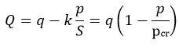{ #fig:004 width=70% }

где q – максимальная потребность одного человека в продукте в единицу времени. Эта функция падает с ростом цены и при p = pcr (критическая стоимость продукта) потребители отказываются от приобретения товара. Величина pcr = Sq/k. Параметр k – мера эластичности функции спроса по цене. Таким образом, функция спроса в форме (1) является пороговой (то есть, Q(S/p) = 0 при p ≥ pcr) и обладает свойствами насыщения. Уравнения динамики оборотных средств можно записать в виде
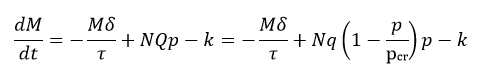{ #fig:005 width=70% }
Уравнение для рыночной цены p представим в виде
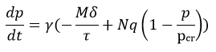{ #fig:006 width=70% }
Первый член соответствует количеству поставляемого на рынок товара (то есть, предложению), а второй член – спросу. Параметр γ зависит от скорости оборота товаров на рынке. Как правило, время торгового оборота существенно меньше времени производственного цикла τ. При заданном M уравнение (3) описывает быстрое стремление цены к равновесному значению цены, которое устойчиво. В этом случае уравнение (3) можно заменить алгебраическим соотношением
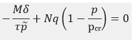{ #fig:007 width=70% }
Из этого следует, что равновесное значение цены p равно
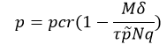{ #fig:008 width=70% }
Уравнение с учетом приобретает вид
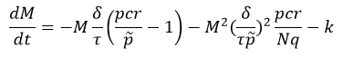{ #fig:009 width=70% }
Уравнение имеет два стационарных решения, соответствующих условию dM/dt = 0:
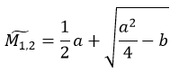{ #fig:0010 width=70% }
где
![Рис. 11. Уравнения]image/11.PNG){ #fig:0011 width=70% }
Из (7) следует, что при больших постоянных издержках (в случае a 2 < 4b) стационарных состояний нет. Это означает, что в этих условиях фирма не может функционировать стабильно, то есть, терпит банкротство. Однако, как правило, постоянные затраты малы по сравнению с переменными (то есть, b << a 2 ) и играют роль, только в случае, когда оборотные средства малы. При b << a стационарные 
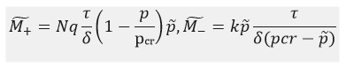{ #fig:0012 width=70% }
Первое состояние M устойчиво и соответствует стабильному функционированию предприятия. Второе состояние M неустойчиво, так, что при M M  оборотные средства падают (dM/dt < 0), то есть, фирма идет к банкротству. По смыслу M соответствует начальному капиталу, необходимому для входа в рынок. В обсуждаемой модели параметр δ всюду входит в сочетании с τ. Это значит, что уменьшение доли оборотных средств, вкладываемых в производство, эквивалентно удлинению производственного цикла. Поэтому мы в дальнейшем положим: δ = 1, а параметр τ будем считать временем цикла, с учётом сказанного.


# Выполнение лабораторной работы

Написала программу на Modelica для случая 1:
```
model lab08.1
  parameter Real p_cr = 35;
  parameter Real taul = 18;
  parameter Real pl = 7.7;
  parameter Real tau2 = 13;
  parameter Real p2 = 0.9;
  parameter Real N = 30;
  parameter Real q = 1;
  
  parameter Real a1 = p_cr/ (tau1*tau1*p1*p1*N*q);
  parameter Real a2 = p_cr/ (tau2*tau2*p2*p2*N*q);
  parameter Real b = p_cr/ (tau1*tau1* tau2*tau2*p1*p1*p2*p2*N*q);
  parameter Real c1 = (p_cr-p1)/(tau1*p1);
  parameter Real c2 = (p_cr-p2)/(tau2*p2); 
  
  parameter Real M0_1=5.4;
  parameter Real M0_2=4.1;
  Real M1 (start=M0_1);
  Real M2 (start=M0_2);
equation
  der (M1) = M1 – (b/c1)*M1*M2 – (a1/c1)*M1*M1;
  der (M2) = (c2/c1)*M2 – (b/c1+0.00053)*M1*M2 – (a2/c1)*M2*M2;
end lab8.1;

```
Получила следующий график для случая 1 (см. рис. -@fig:001).

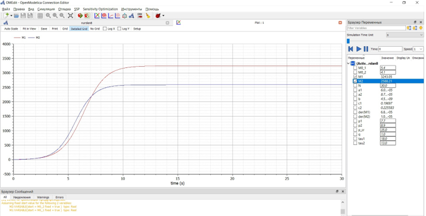{ #fig:0013 width=70% }  

Написала программу на Modelica для случая 2:
```
model lab08.2
  parameter Real p_cr = 35;
  parameter Real taul = 18;
  parameter Real pl = 7.7;
  parameter Real tau2 = 13;
  parameter Real p2 = 0.9;
  parameter Real N = 30;
  parameter Real q = 1;
  
  parameter Real a1 = p_cr/ (tau1*tau1*p1*p1*N*q);
  parameter Real a2 = p_cr/ (tau2*tau2*p2*p2*N*q);
  parameter Real b = p_cr/ (tau1*tau1* tau2*tau2*p1*p1*p2*p2*N*q);
  parameter Real c1 = (p_cr-p1)/(tau1*p1);
  parameter Real c2 = (p_cr-p2)/(tau2*p2); 
  
  parameter Real M0_1=5.4;
  parameter Real M0_2=4.1;
  Real M1 (start=M0_1);
  Real M2 (start=M0_2);
equation
  der (M1) = M1 – (b/c1)*M1*M2 – (a1/c1)*M1*M1;
  der (M2) = (c2/c1)*M2 – (b/c1+0.00053)*M1*M2 – (a2/c1)*M2*M2;
end lab8.2;

```
Получила следующий график для случая 2 (см. рис. -@fig:002).

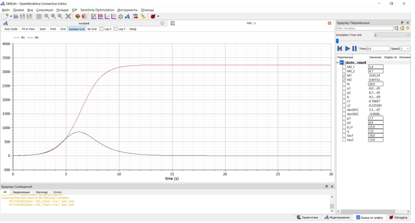{ #fig:0014 width=70% }

# Выводы

Ознакомилась с моделью конкуренции двух фирм для двух случаев
Построила график распространения рекламы.

# Список литературы{.unnumbered}

::: {#refs}
:::
